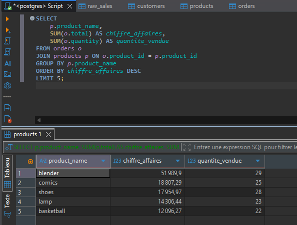
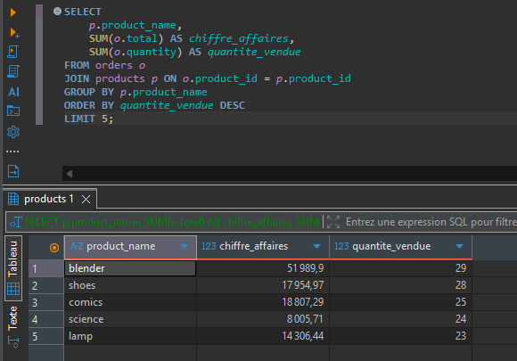
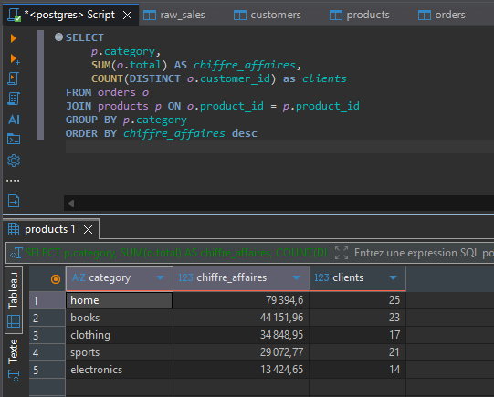
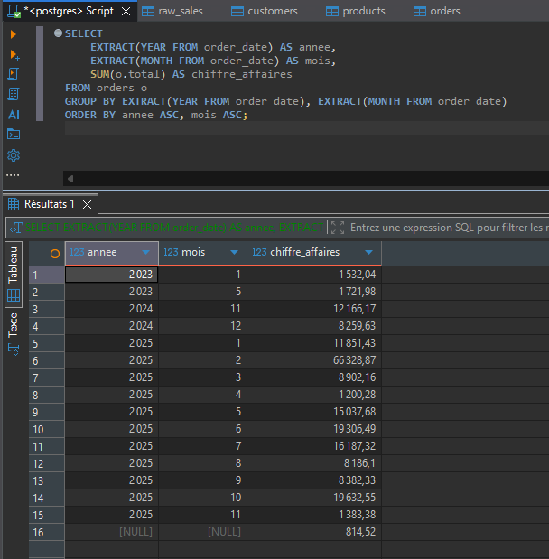
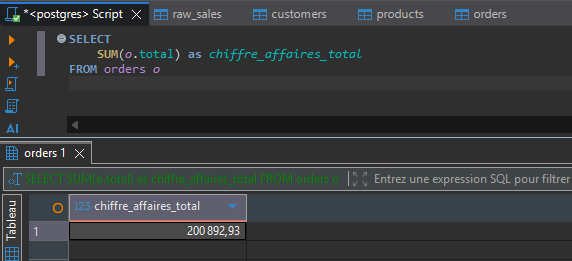

# Projet 1 - Analyse e-commerce : SQL & nettoyage de données

## Mise en situation

Le gérant d'une boutique en ligne exporte régulièrement ses données de vente depuis son système de commande, mais cet export brut n'a jamais été vérifié ni nettoyé : dates dans des formats différents, prix parfois saisis en texte, quantités négatives, catégories mal orthographiées ou incohérentes, doublons de commandes...

Avant de pouvoir piloter son activité, il a besoin de réponses fiables à ces questions :

* Quels sont nos produits qui rapportent le plus de chiffre d'affaires, et lesquels se vendent le plus en quantité ?
* Quelles catégories de produits attirent le plus de clients, et lesquelles génèrent le plus de chiffre d'affaires ?
* Nos ventes varient-elles selon les mois ?
* Quel est notre chiffre d'affaires total, et comment évolue-t-il ?

**Ma mission :** partir de cet export brut, concevoir une base de données relationnelle propre, identifier et corriger les problèmes de qualité des données, puis produire les requêtes SQL répondant à ces questions.

## Dataset

Source : [Messy E-Commerce Sales Dataset](https://www.kaggle.com/datasets/kandeelai22/messy-e-commerce-sales-dataset) (Kaggle)

| Colonne | Description |
|---|---|
| `ID` | Identifiant de la ligne |
| `Customer_Name` | Nom du client |
| `Order_ID` | Identifiant de la commande |
| `Order_Date` | Date de la commande |
| `Product` | Nom du produit |
| `Category` | Catégorie du produit |
| `Quantity` | Quantité commandée |
| `Price` | Prix unitaire |
| `Payment_Method` | Moyen de paiement |
| `Status` | Statut de la commande |
| `Total` | Montant total de la ligne |

## Schéma de la base

Trois tables reliées entre elles (*customers*, *products*, *orders*) voir *sql/01_create_tables.sql*.

## Démarche

1. Exploration du fichier brut : colonnes, types, premiers problèmes de qualité
2. Conception du schéma relationnel (*customers*, *products*, *orders*)
3. Création des tables dans PostgreSQL (*sql/01_create_tables.sql*)
4. Import des données brutes dans une table de staging (*raw_sales*) sans modification
5. Nettoyage des données vers les tables finales (*sql/02_cleaning.sql*) :
   * Doublons de commandes détectés et résolus par cohérence *total = price × quantity*
   * Casse incohérente sur produits/catégories uniformisée (*LOWER()*)
   * Catégories contradictoires par produit résolues par la valeur majoritaire (*MODE()*)
   * Prix/quantités invalides ou manquants complétés par la médiane des valeurs valides du même produit
   * Dates dans des formats hétérogènes uniformisées (*TO_DATE()*), valeurs invalides mises à *NULL*
6. Requêtes d'analyse business répondant aux questions du gérant (*sql/03_analysis_queries.sql*)
7. Export SQLite de la base nettoyée

## Résultats

1. **Top produits** : Quels sont nos produits qui rapportent le plus de chiffre d'affaires, et lesquels se vendent le plus en quantité ?

**Blender** est le produit star de la boutique : n°1 à la fois en chiffre d'affaires et en quantité vendue.

Les deux classements (CA et quantité) ne se recoupent pas totalement, ce qui distingue deux profils de produits :
* **Science** figure dans le top 5 par quantité vendue, mais pas dans le top 5 par chiffre d'affaires : un produit qui se vend souvent, mais à faible valeur unitaire.
* **Basketball** figure dans le top 5 par chiffre d'affaires, mais pas dans le top 5 par quantité : un produit moins vendu, mais plus rentable à l'unité.

2. **Segmentation par catégorie** : Quelles catégories de produits attirent le plus de clients, et lesquelles génèrent le plus de chiffre d'affaires ?

**Home** est la catégorie la plus rentable, à la fois en chiffre d'affaires total (79 395) et en nombre de clients (25). Mais l'écart est plus marqué qu'il n'y paraît : rapporté au nombre de clients, un acheteur "home" dépense en moyenne **3 176**, contre seulement **959** pour un acheteur "electronics", soit plus de 3 fois plus.

3. **Saisonnalité** : Nos ventes varient-elles selon les mois ?
 
Le mois de **février 2025** se distingue avec un chiffre d'affaires largement supérieur aux autres mois (**66 329**, contre une moyenne d'environ **12 000** sur le reste de la période).

Cependant, ce pic ne se retrouve ni en février 2023 ni en février 2024 : il s'agit probablement de quelques commandes ponctuelles à forte valeur, plutôt que d'une véritable saisonnalité récurrente. Le faible volume de données disponible (100 commandes réparties sur environ 3 ans) limite de toute façon la capacité à identifier une saisonnalité fiable sur ce dataset.

4. **Chiffre d'affaires global**: Quel est notre chiffre d'affaires total, et comment évolue-t-il ?

Le chiffre d'affaires total sur l'ensemble de la période couverte par le dataset (environ 3 ans, 100 commandes) s'élève à **200 892,93**.

Son évolution mois par mois est détaillée dans la section [Saisonnalité](#saisonnalité) ci-dessus : hormis le pic isolé de février 2025, le CA mensuel reste globalement compris entre 1 200 et 20 000, sans tendance de croissance ou de baisse marquée sur la période.

