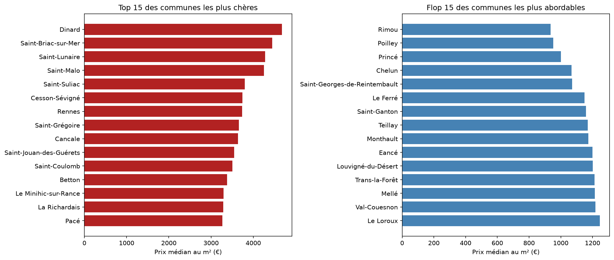
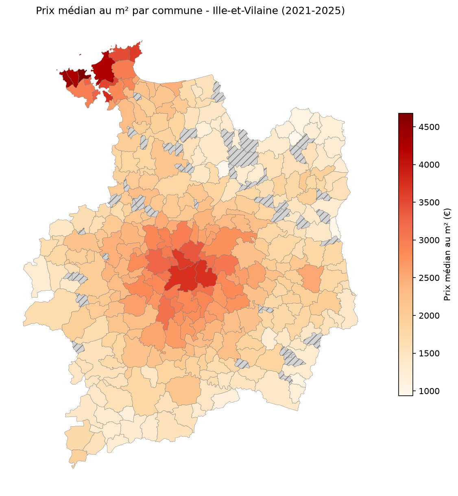

# Projet 2 - Marché immobilier en Ille-et-Vilaine : exploration Python & data storytelling

## Mise en situation

Une agence immobilière implantée à Rennes veut objectiver son discours commercial. Ses conseillers s'appuient aujourd'hui sur leur intuition du marché, mais les clients arrivent de plus en plus informés et demandent des chiffres. L'agence dispose d'une source fiable et publique, les Demandes de Valeurs Foncières (DVF) publiées par l'État, qui recensent toutes les ventes immobilières.

Elle a besoin d'une analyse claire du marché de l'Ille-et-Vilaine pour appuyer ses conseils, et se pose les questions suivantes :

* Comment les prix au m² ont-ils évolué en Ille-et-Vilaine entre 2021 et 2025 ?
* Quelles communes du département sont les plus chères, lesquelles restent les plus abordables, et où se situe Rennes dans ce classement ?
* Quel écart de prix existe entre maisons et appartements sur cette période, et lequel des deux marchés est le plus dynamique en volume de ventes ?
* La surface d'un bien influence-t-elle son prix au m² ?
* Les ventes se concentrent-elles sur certaines périodes de l'année entre 2021 et 2025 ?

**Ma mission :** partir des données brutes DVF, isoler le périmètre pertinent (Ille-et-Vilaine, 2021-2025), nettoyer et explorer ce jeu de données, puis produire une analyse visuelle et écrite répondant à ces questions.

## Dataset

Source : [Demandes de valeurs foncières géolocalisées](https://www.data.gouv.fr/datasets/demandes-de-valeurs-foncieres-geolocalisees) (data.gouv.fr / DGFiP)

Périmètre retenu : département d'Ille-et-Vilaine (35), transactions entre 2021 et 2025.

Colonnes principales utilisées :

| Colonne | Description |
|---|---|
| `id_mutation` | Identifiant technique de la vente, utilisé pour repérer et traiter les doublons de mutation (pas une colonne business en soi) |
| `date_mutation` | Date de la vente |
| `valeur_fonciere` | Montant de la vente |
| `type_local` | Type de bien (maison, appartement) |
| `surface_reelle_bati` | Surface habitable du bien |
| `code_commune` / `nom_commune` | Localisation du bien (commune) |
| `longitude` / `latitude` | Coordonnées géographiques de la parcelle |
| `annee` | Année de la vente (ajoutée au chargement, une par fichier source) |

Note méthodologique : la colonne `nature_mutation` a été utilisée pour ne conserver que les transactions de type "Vente" (en excluant échanges, expropriations, adjudications, et ventes en l'état futur d'achèvement), puis retirée du jeu de données final.

Les fichiers bruts couvrent toute la France : un premier travail consistera à filtrer sur le département 35, sélectionner les colonnes utiles, et écarter les types de biens hors sujet (locaux commerciaux, terrains non bâtis) pour se concentrer sur les logements.

## Démarche

1. Récupération des fichiers DVF géolocalisés (2021 à 2025) et filtrage sur l'Ille-et-Vilaine
2. Exploration initiale : structure du fichier, types de colonnes, valeurs manquantes, doublons
3. Nettoyage : valeurs aberrantes (prix ou surfaces incohérents), doublons de mutation, filtrage sur les types de biens pertinents (maisons et appartements)
4. Calcul du prix au m² par transaction
5. Analyse exploratoire : évolution temporelle des prix, comparaison des communes, écarts maison/appartement, effet de la surface, saisonnalité des ventes
6. Visualisations avec matplotlib
7. Carte choroplèthe des prix par commune avec geopandas
8. Rédaction du récit final (data storytelling) à partir des résultats obtenus

## Résultats

### Évolution des prix (2021-2025)
Le prix médian au m² en Ille-et-Vilaine est passé de 2 472 €/m² en 2021 à 2 745 €/m² en 2025, soit une hausse de 11 % sur la période. Cette progression n'est pas régulière : elle se concentre presque entièrement sur 2021-2022 (+10,5 % en un an), suivie d'un plateau ondulant sans nouvelle tendance haussière marquée.

### Classement des communes
Le prix médian au m² varie de 936 €/m² (Rimou) à 4 678 €/m² (Dinard), un rapport de 1 à 5 au sein du même département. Deux zones dominent le haut du classement : la Côte d'Émeraude (Dinard, Saint-Malo, Saint-Briac-sur-Mer, Cancale...) et la première couronne rennaise (Cesson-Sévigné, Saint-Grégoire, Betton, Pacé...). Rennes se classe 7e sur 300 communes analysées, à 3 734 €/m².

### Maisons vs appartements
Un appartement se vend en moyenne 41,9 % plus cher au m² qu'une maison (3 241 €/m² contre 2 285 €/m²). En volume, les maisons dominent le marché (59 % des ventes), une répartition stable dans le temps. Le vrai mouvement se lit dans le volume total : -31,9 % entre 2021 et son point bas en 2024, avant un rebond partiel en 2025.

### Effet de la surface
Plus un bien est grand, moins son prix au m² est élevé (corrélation de -0,282). Le prix médian passe de 3 553 €/m² pour les biens de moins de 50 m² à 2 012 €/m² pour ceux de 150 m² et plus, un écart de 76,6 %.

### Saisonnalité
Juillet est le mois le plus actif (8 747 ventes cumulées 2021-2025), février le plus calme (5 194 ventes), un écart de 68,4 % entre les deux, cohérent avec la logique de déménagement avant la rentrée scolaire.

## Limites méthodologiques

* Les ventes en l'état futur d'achèvement (VEFA) sont exclues de l'analyse : elles n'ont presque jamais de surface ou de type de bien renseigné dans le DVF.
* La méthode statistique IQR (détection de valeurs aberrantes) ne fonctionne pas nativement sur une distribution de prix : seule la borne haute a pu être appliquée automatiquement, la borne basse a nécessité une décision raisonnée au cas par cas.
* Le classement des communes et la carte n'incluent que les communes avec au moins 30 ventes sur la période, pour garantir une médiane fiable ; en dessous de ce seuil, les valeurs affichées (uniquement sur la carte, où elles sont visuellement signalées) sont à interpréter avec prudence.